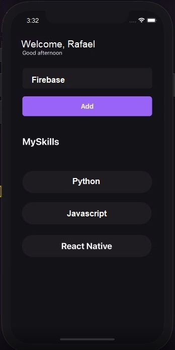

<h1 align="center">
  
</h1>

  
  
  
  
  
  

# Ignite_React-Native_Activity_01

React Native activity done with 'Rocketseat' Ignite course. ("Chapter I")

## 💻 Sobre o capítulo - Fundamentos React Native

Nesse capítulo, vamos aprender o ecossistema do desenvolvimento mobile com React Native, criar e compreender a estrutura de projetos React Native com a CLI além de conhecer os principais conceitos por volta da biblioteca como componentes, propriedades, estado, imutabilidade, hooks, estilização e utilização do TypeScript.

<h1 align="center">
     
</h1>
